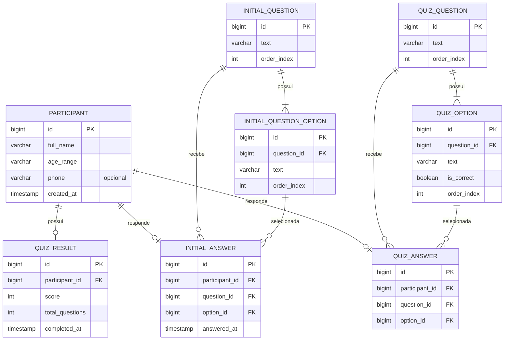

# Modelo de Dados

## Diagrama ER

## Justificativas de modelagem

- **`Participant` sem oficina/turma associada**: conforme decisão do
  planejamento, o evento é tratado como único no MVP; se no futuro for
  necessário rastrear múltiplas edições, basta introduzir uma entidade
  `Workshop` e uma FK opcional em `Participant`, sem quebrar o restante do
  modelo.
- **Questionário inicial e Quiz como módulos paralelos e independentes**,
  em vez de um modelo genérico único de "pergunta/resposta". O Quiz precisa
  de `is_correct` na opção para permitir correção automática (RF07); o
  questionário inicial não tem essa noção. Compartilhar uma tabela geraria
  uma coluna `is_correct` sempre nula para o questionário inicial — um
  cheiro de modelagem pior do que duplicar duas tabelas simples.
- **`QuizResult` é uma tabela de resumo, não recalculada em toda consulta.**
  O `Service` calcula a pontuação no momento da submissão do quiz e persiste
  o resultado agregado; `QuizAnswer` guarda o detalhe de cada resposta para
  a funcionalidade "Visualizar respostas" do Epic 7. Isso evita recalcular
  agregações a cada carregamento do dashboard (RF09).
- **Perguntas e opções (`INITIAL_QUESTION*`, `QUIZ_*QUESTION/OPTION`) são
  seed data via Flyway**, não cadastradas pela interface — não há tela de
  CRUD de perguntas no MVP, mantendo o escopo simples.
- **Sem exclusão física de participante no MVP** — apenas leitura/edição
  (RF02); exclusão pode ser avaliada futuramente se necessário para LGPD.
